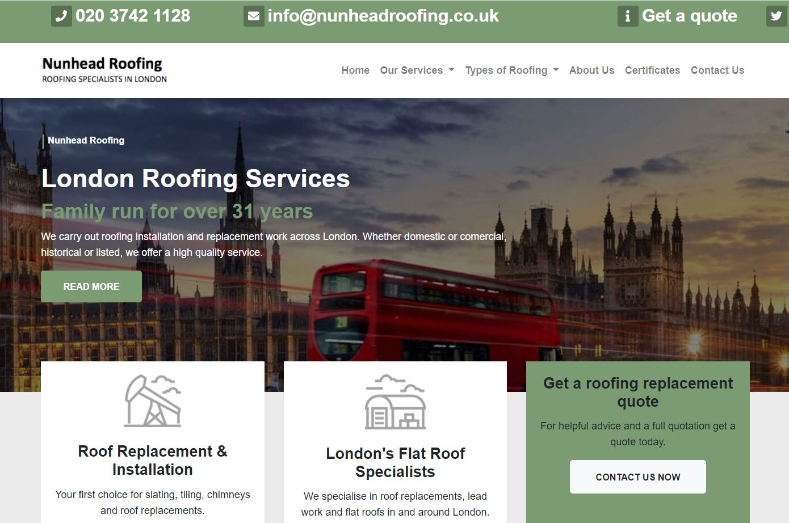
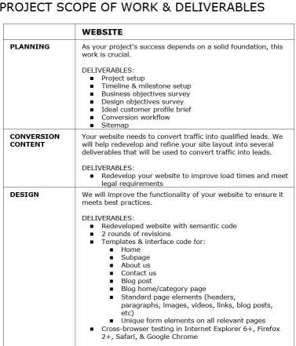
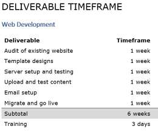
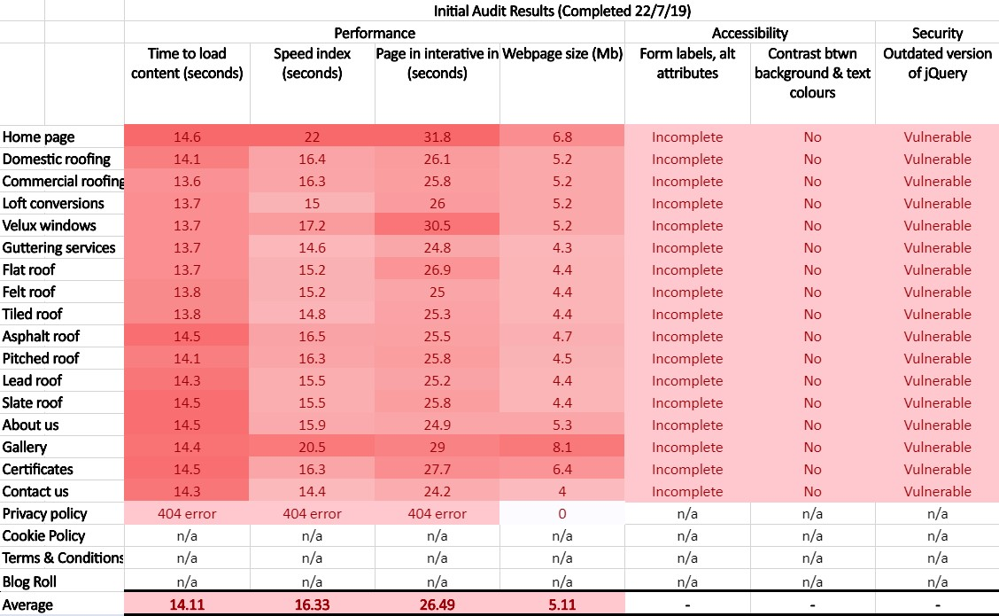
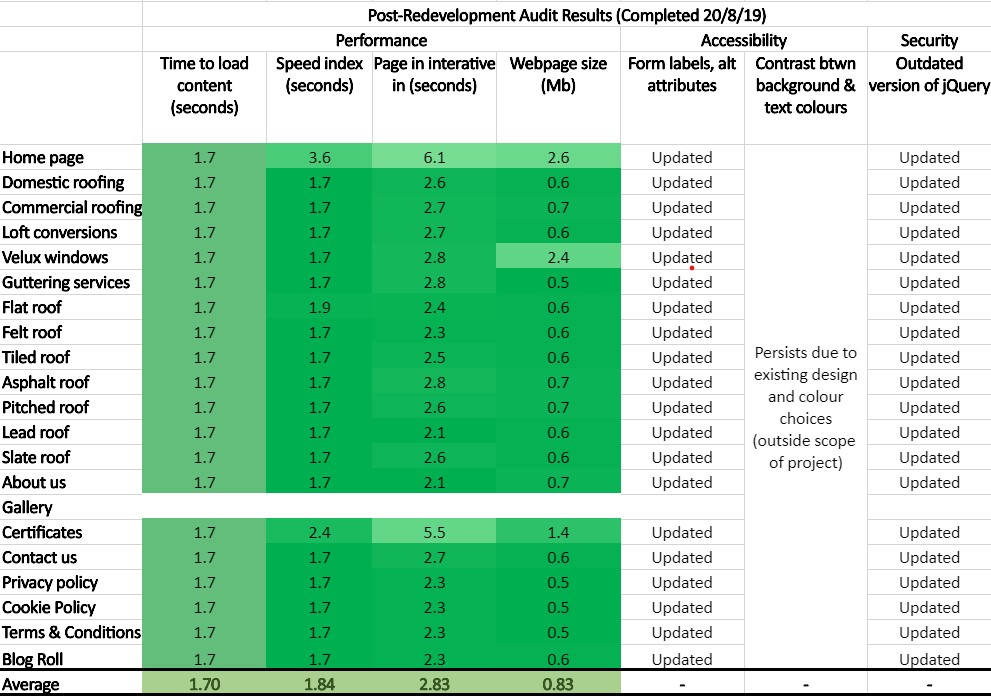
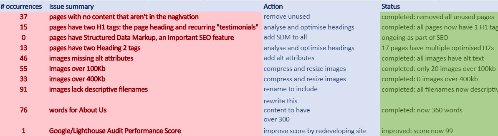

# Nunhead Roofing

## Overview
The aim of this project was to redevelop a client's website from scratch to improve performance and drive sales for their small business. The client had an existing website that was incredibly slow and not fully compliant. Over the course of 6 weeks, I planned, developed and deployed the site, working with the client to ensure it met their expectations.

The result was a new website with clean code, good security and vastly improved performance.

It is deployed at https://www.nunheadroofing.co.uk/

## Approach
Before I started coding, I undertook a detailed planning process. I completed an audit of the old website so I could see what needed to be improved, and then I spent time talking to the client to understand their business needs and what they wanted to get out of the website. I used this information to create a development roadmap and schedule. After agreeing the schedule with the client, I used Microsoft Teams to track my progress against tasks and subtasks, which greatly helped me focus and prioritise. I began coding the templates offline before configuring them in the Umbraco CMS. Throughout the process, I made an effort to be in regular communication with my client to update them on progress and to ask about content and design decisions.

## Achievements
The website redevelopment was highly successful with performance improved by an average of 87% across the site. 

### Audit of old website

### Audit of new website

### Performance improvements
* Google / Lighthouse performance score increased from 1 on the old site to 99
* average load time reduced from 14 seconds to 1.7 seconds
* average Speed Index reduced from 16 seconds to 1.8 seconds
* average time until pages are interactive from 26 seconds to 2.8 seconds.
* webpage size was greatly reduced from 5Mb to 0.8Mb without compromising on quality
  * unnecessary code removed
  * images compressed
    * reduced number of 100Kb images from 55 on the old site to 20
    * reduced number of 400Kb images from 33 to 0

### SEO improvements:
* decreased load times
* rewrote about page from 76 to 360 words
* optimising site structure / URLs

### Security improvements:
* removed vulnerable links to outdated jQuery scripts
* added SSL certificate

### Accessibility improvements:
* added alt text to all images
* added labels to all form elements

I also created a series of personalised training videos for the client so that they can learn how to upload their own images and edit the page text. The feedback I've had so far has been all positive.

### Summary of resolved issues

## Technologies
* Umbraco CMS
* HTML
* CSS
* Bootstrap
* Kudu / Git

## Reflection
Before starting this project, I felt somewhat overwhelmed with the scale of the project, especially since it was for an already existing business that needed to minimise down time and maximise their digital footprint. I was comfortable with HTML and CSS and how to structure the content, but I was completely new to the Umbraco CMS, which is built on C#, something I'd never worked with before either. I learnt how to set up document types, templates and pages in the CMS. My misconceptions included a lack of understanding of document types, templates and includes but after reading the documentation and working with my mentor, I was able to implement all of these features successfully. I also learnt how to use Kudu (an online CLI deployment of Git on Azure) for the first time by building on my knowledge of command line.

After completing the project, I felt a great sense of accomplishment, having published a medium-size functional website for a real world client that brings him business. I was happy with the performance improvements, decreasing the load time of the home page by over 80%. I was proud to have worked with new technologies and overcome challenges along the way.

### Main learning points:
* the importance of thorough planning
* assigning deadlines to tasks, even for myself
* learning Bootstrap
* how to use Umbraco CMS, inlcuding creating documents types & templates, assigning permissions, using includes, and deployment

### Next Steps
I'm now working with the client on their SEO to boost search ranking and local listings. When I have more time to work on the website itself, I would like to implement a scrolling carousel of testimonials to showcase more of their customer's thoughts. I would also like to experiment with different styles and positioning for the calls to action on various pages, in an effort to increase sales. Finally, I would like to improve the templating so that the client is able to edit more parts of the website themselves, such as the home and about pages.
